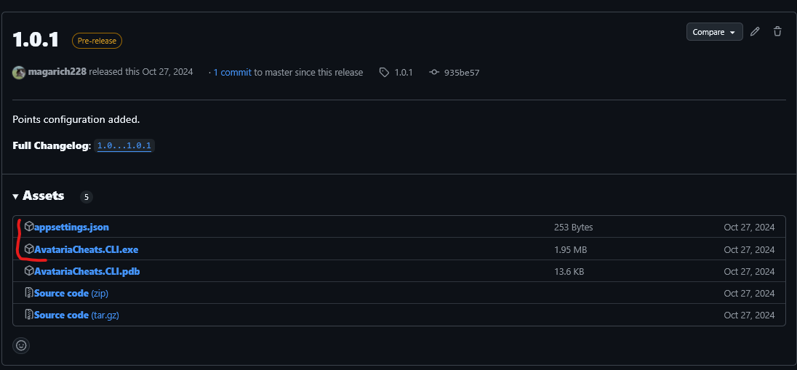

# Avataria cheats

Простая программа прездназначенна для старой игры **[Аватария](https://tortuga.games/games/avatariya/)** десктопного формата (**не Web-версии!**). В игре присутсвует игровая валюта в виде золотых монет, на которые можно купить мебель для дома, одежду и многое другое. Монеты можно зарабывать выпоняют различия задания или играя в мини игры. Одной из мини игр является классическая "Dance Dance Revolution". В контексте Аватарии это очень тяжелая мини игра, но за большое количество очков здесь можно заработать сразу 65 золотых монет за 12 с небольшим минут, что является лучшим способ разбогатеть, данная программа упростит этот процесс.

## Начало работы

Эти инструкции предоставлят вам копию прораммного обеспечения.

### Необходимые условия

Каких то специальных условий, требующихся для использования программы не требуется!

### Установка

1. Необходимо перейти по данной **[ссылке](https://github.com/magarich228/AvatariaCheats/releases/tag/1.0.1)** и скачать минимально необходимые компоненты в виде файла конфигурации и .exe файла.

## Инструкция

### Для автоматической игры необходимо:

1. Запусти игру через лаунчер [Tortuga](https://tortuga.games/tgc/) и разверни её на полный экран.
2. Зайди в мини игру.
3. Запусти программу `.\AvatariaCheats.CLI.exe`.
4. Начни мини игру и зарабатывай деньги!

### Видео инструкция:

https://github.com/user-attachments/assets/933d7496-24dd-4591-8fe7-e58b12aca61c

## Авторы

- Грошев Кирилл - разработчик - [magarich228](https://github.com/magarich228), [gogs](https://gogs.ngknn.ru/magarich228)
